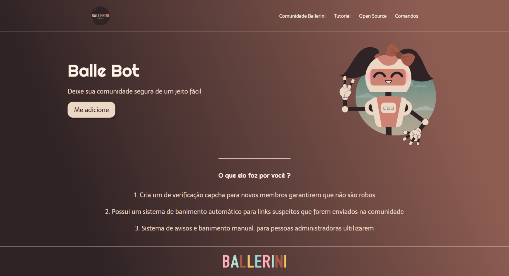

  <h1>🤖 Balle Bot</h1>
  
<strong>Landing page de apresentação do bot de moderação para comunidades online</strong>

  
  
  

---

> 🗃️ **Projeto arquivado.** Este repositório está preservado como registro da minha evolução como desenvolvedor. Foi meu primeiro projeto público no GitHub, criado enquanto aprendia a programar do zero.

---

## 📸 Preview

---

## 🚀 Sobre o Projeto

**Balle Bot** foi um bot de moderação para comunidades online. Esta é a landing page de apresentação do projeto, desenvolvida com HTML e CSS puro como um dos meus primeiros passos no desenvolvimento web.

---

## ✨ O que foi implementado

- 🛡️ **Captcha de verificação** — novos membros provam que não são robôs
- 🚫 **Banimento automático** — links suspeitos são removidos automaticamente
- ⚠️ **Sistema de avisos e banimento manual** — ferramentas para administradores

---

## 🛠️ Tecnologias

| Tecnologia | Uso |
|---|---|
| HTML5 | Estrutura da página |
| CSS3 | Estilização com Flexbox, gradientes e Google Fonts |

---

## ⚙️ Como Executar Localmente

Basta abrir o arquivo [index.html](index.html) no navegador — nenhuma dependência ou build necessário.

---

  
Feito com ❤️ por <strong>Allan Maia</strong>

